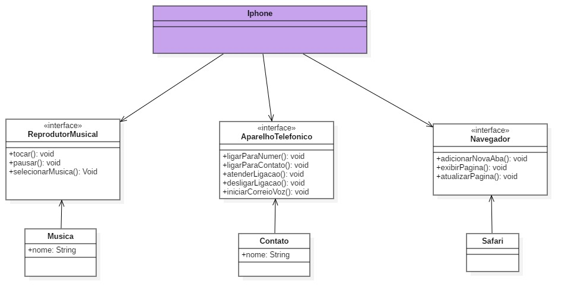

# Modelando o iPhone com UML

### Com base no vídeo de lançamento do iPhone, elaborou-se a diagramação das classes e interfaces, representando as funções do iPhone como Reprodutor Musical, Aparelho Telefônico e Navegador na Internet. Após isso, foi criada as classes e interfaces em Java. Testando todas as funções.

O Diagrama abaixo demonstra como foi pensado a modelagem do "Iphone"

